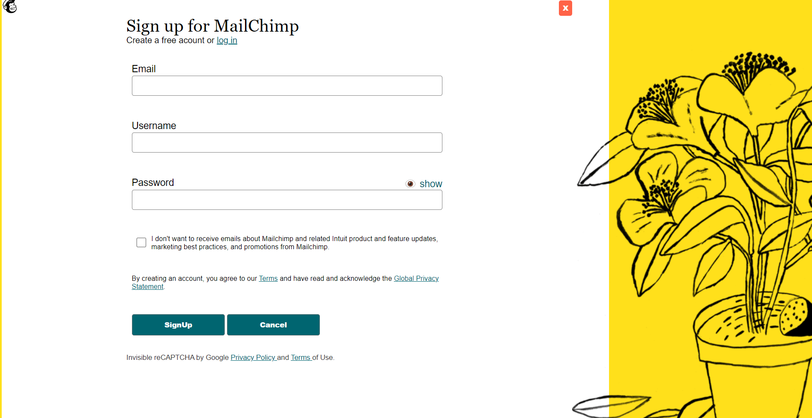
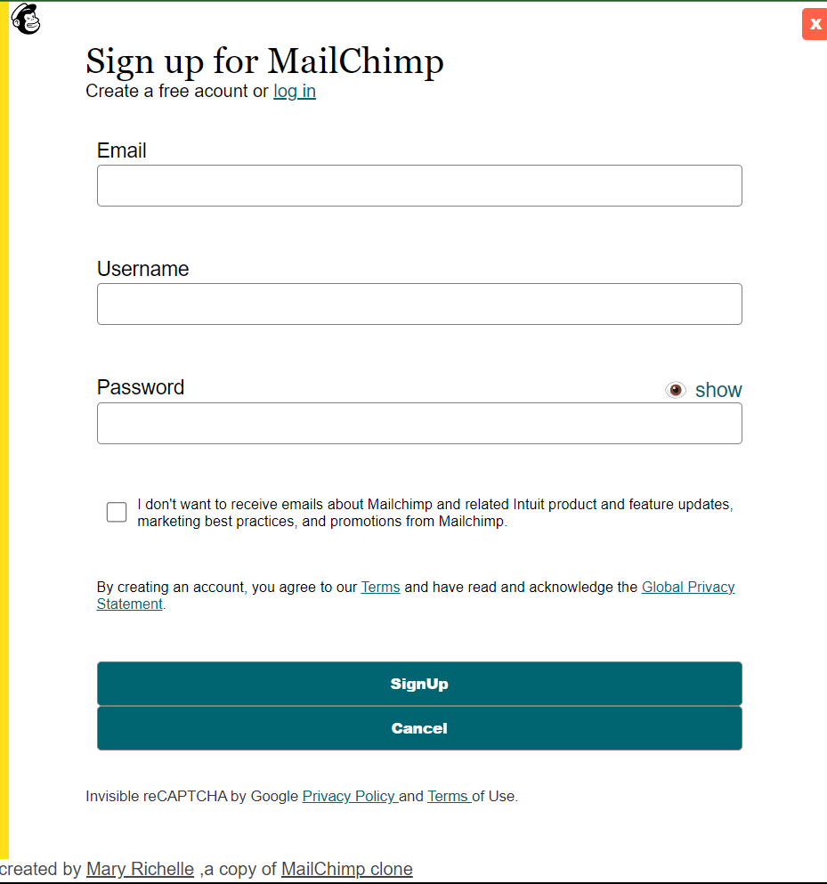

# MailChimp clone and ARIA-describedby Example

## [Live Demo](https://maryrichelle.github.io/Mailchimp-clone/)

## What I have learned in this project

* Usage of Semantic HTML
* Accessibility
  * How to use ARIA Attribute
  * Aria-label
  * Aria-labelledby
  * Aria-describedby
* Form validation
  * Regex Expression
* working with css pseudo classes
* SEO Best Practices

### *this app is 100% Accessible you can check using [axe dev tool extension](https://chrome.google.com/webstore/detail/axe-devtools-web-accessib/lhdoppojpmngadmnindnejefpokejbdd) or Light house in Chrome dev tools*

